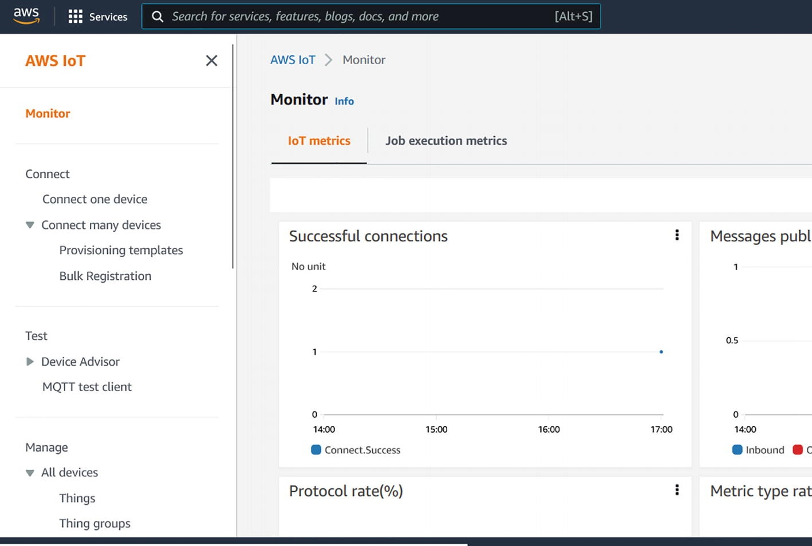

# Spring Cloud Function on the Cloud with AWS IoT
Consider a use case where an automotive assembly plant wants to ensure that its robots are performing well. The engineers want to ensure that each of the robot's data is monitored for any anomalies and, in an event of a breakdown, the engineers are alerted. The assembly plant is firewalled and any data that needs to be analyzed can be sent to the cloud.

The solution is a hybrid cloud environment that isolates the assembly plant floor but connects to the cloud to send data from the plant floor. Figure 6-3 shows a solution that is implemented with AWS products that can be deployed on-premises and connect to the cloud to synchronize the data with the rest of the systems involved in decision-making.


> Figure 6-3 Manufacturing plant process flow with AWS and Spring Cloud Function  

Solution components:
* AWS IoT Greengrass on-premises
* Prebuilt AWS Lambda functions that capture the sensor data
* AWS IoT core on cloud
* Spring Cloud Function running on AWS Lambda
* S3 storage to store the data



You can build the solution using AWS IoT Greengrass and leverage a Spring Cloud Function that is deployed on Lambda. The point of this exercise is to understand the capabilities of Spring Cloud Function as a component that is integral to the solution.

The AWS IoT Greengrass implementation extends AWS Cloud to on-premises. You can run Lambda functions on Greengrass’s edge.

## Step 1: Install AWS IoT Greengrass. Install AWS IoT Greengrass on a device (https://docs.aws.amazon.com/greengrass/v1/developerguide/install-ggc.xhtml).

 To test it, I installed the software on Windows. I used the tutorial at https://aws.amazon.com/blogs/iot/aws-iot-greengrass-now-supports-the-windows-operating-system/ to get my first Greengrass implementation.

Once you have AWS IoT up and running, you need to create a function to connect to devices and collect data. Let’s create a sample function.

## Step 2: Spring Cloud Function to publish an MQTT message. 
You can clone the project from GitHub at https://github.com/banup-kubeforce/AWSIots3-V2.git.
Devices communicate with MQTT, so you need to leverage MQTT as a protocol. Create a Spring Cloud Function that publishes an MQTT message and create a consumer function to call MQTT publish.

This consumer will publish data using the `MqttPublish` class and will be the function that is exposed by Lambda; see Listing 6-1.
```java
package com.kubeforce.awsgreengrassiot;
import org.hibernate.cache.internal.StandardTimestampsCacheFactory;
import org.slf4j.Logger;
import org.slf4j.LoggerFactory;
import org.springframework.beans.factory.annotation.Autowired;
import java.util.Map;
import java.util.function.Consumer;
public class MqttConsumer  implements Consumer<Map<String,String>> {
    public static final Logger LOGGER = LoggerFactory.getLogger(MqttConsumer.class);
    @Autowired
    private MqttPublish mqttPublish;
    @Override
    public void accept (Map<String, String> map )
    {
        LOGGER.info("Adding Device info", map);
        MqttPublish mqttPublish= new MqttPublish();
    }
}
```
> Listing 6-1 MqttConsumer.java

Next, create a `publish` class to publish messages to MQTT.

The `MqttPublish` class sends data using the `IoTDataClient` that is provided by AWS Greengrass SDK, to construct and send data. See Listing 6-2.
```java
import java.nio.ByteBuffer;
import java.util.Timer;
import java.util.TimerTask;
import com.amazonaws.services.lambda.runtime.Context;
import com.amazonaws.greengrass.javasdk.IotDataClient;
import com.amazonaws.greengrass.javasdk.model.*;
public class MqttPublish {
    static {
        Timer timer = new Timer();
        // Repeat publishing a message every 5 seconds
        timer.scheduleAtFixedRate(new PublishDeviceInfo(), 0, 5000);
    }
    public String handleRequest(Object input, Context context) {
        return "Here is the device info";
    }
}
    class PublishDeviceInfo extends TimerTask {
        private IotDataClient iotDataClient = new IotDataClient();
        private String publishMessage = String.format("Device info sent from device running on platform: %s-%s using Java", System.getProperty("os.name"), System.getProperty("os.version"));
        private PublishRequest publishRequest = new PublishRequest()
                .withTopic("device/info")
                .withPayload(ByteBuffer.wrap(String.format("{\"message\":\"%s\"}", publishMessage).getBytes()))
                .withQueueFullPolicy(QueueFullPolicy.AllOrException);
        public void run() {
            try {
                iotDataClient.publish(publishRequest);
            } catch (Exception ex) {
                System.err.println(ex);
            }
        }
    }
```
> Listing 6-2 MqttPublish.java

## Step 3: Deploy the Spring Cloud Function on AWS Greengrass locally.

AWS provides a great guide for deploying Lambda function on Greengrass at `Run Lambda functions on the AWS IoT Greengrass core - AWS IoT Greengrass (amazon.com)`.

As described in Chapter 2, you will bundle the Spring Cloud Function and publish it to Lambda. Alternatively, you can also use these CLI commands:
```bash
aws lambda create-function \
  --region aws-region \
  --function-name  MqttConsumer \
  --handler executable-name \
  --role role-arn \
  --zip-file fileb://Application_Name.zip \
  --runtime arn:aws:greengrass:::runtime/function/executable
```

Navigate to the AWS IoT management console, and then click Greengrass, followed by Deployments. You can see the deployed components. Figure 6-4 shows a sample of the management console.


> Figure 6-4 AWS IoT Management console with some successful connections

## Step 4: Create a Spring Cloud Function to get data from the IoT core. 

Create a class to subscribe and get messages from Mqtt.

If you want to access the data that you published, you can run `MqttSubscriber.java` from the command line. You can use `MqttSubscriber.java`. This subscribes to a specific topic, `device/info` for example, and gets the messages. See Listing 6-3.

```java
import software.amazon.awssdk.crt.CRT;
import software.amazon.awssdk.crt.CrtRuntimeException;
import software.amazon.awssdk.crt.mqtt.MqttClientConnection;
import software.amazon.awssdk.crt.mqtt.MqttClientConnectionEvents;
import software.amazon.awssdk.crt.mqtt.QualityOfService;
import software.amazon.awssdk.iot.iotjobs.model.RejectedError;
import java.nio.charset.StandardCharsets;
import java.util.concurrent.CompletableFuture;
import java.util.concurrent.CountDownLatch;
import java.util.concurrent.ExecutionException;
import java.util.concurrent.atomic.AtomicReference;

public class MqttSubscriber  {
    static String ciPropValue = System.getProperty("aws.crt.ci");
    static boolean isCI = ciPropValue != null && Boolean.valueOf(ciPropValue);
    static String topic = "device/info";
    static String message = "Device Info";
    static int    messagesToPublish = 10;
    static CommandLineUtils cmdUtils;
    static void onRejectedError(RejectedError error) {
        System.out.println("Request rejected: " + error.code.toString() + ": " + error.message);
    }
    /*
     * When called during a CI run, throw an exception that will escape and fail the exec:java task
     * When called otherwise, print what went wrong (if anything) and just continue (return from main)
     */
    static void onApplicationFailure(Throwable cause) {
        if (isCI) {
            throw new RuntimeException("BasicPubSub execution failure", cause);
        } else if (cause != null) {
            System.out.println("Exception encountered: " + cause.toString());
        }
    }
    public String MqttSubscribe(){
        final String[] payload = {""};
        cmdUtils = new CommandLineUtils();
        cmdUtils.registerProgramName("PubSub");
        cmdUtils.addCommonMQTTCommands();
        cmdUtils.addCommonTopicMessageCommands();
        cmdUtils.registerCommand("key", "<path>", "Path to your key in PEM format.");
        cmdUtils.registerCommand("cert", "<path>", "Path to your client certificate in PEM format.");
        cmdUtils.registerCommand("client_id", "<int>", "Client id to use (optional, default='test-*').");
        cmdUtils.registerCommand("port", "<int>", "Port to connect to on the endpoint (optional, default='8883').");
        cmdUtils.registerCommand("count", "<int>", "Number of messages to publish (optional, default='10').");

        topic = cmdUtils.getCommandOrDefault("topic", topic);
        message = cmdUtils.getCommandOrDefault("message", message);
        messagesToPublish = Integer.parseInt(cmdUtils.getCommandOrDefault("count", String.valueOf(messagesToPublish)));
        MqttClientConnectionEvents callbacks = new MqttClientConnectionEvents() {
            @Override
            public void onConnectionInterrupted(int errorCode) {
                if (errorCode != 0) {
                    System.out.println("Connection interrupted: " + errorCode + ": " + CRT.awsErrorString(errorCode));
                }
            }
            @Override
            public void onConnectionResumed(boolean sessionPresent) {
                System.out.println("Connection resumed: " + (sessionPresent ? "existing session" : "clean session"));
            }
        };
        try {
            MqttClientConnection connection = cmdUtils.buildMQTTConnection(callbacks);
            if (connection == null)
            {
                onApplicationFailure(new RuntimeException("MQTT connection creation failed!"));
            }
            CompletableFuture<Boolean> connected = connection.connect();
            try {
                boolean sessionPresent = connected.get();
                System.out.println("Connected to " + (!sessionPresent ? "new" : "existing") + " session!");
            } catch (Exception ex) {
                throw new RuntimeException("Exception occurred during connect", ex);
            }
            CountDownLatch countDownLatch = new CountDownLatch(messagesToPublish);
            CompletableFuture<Integer> subscribed = connection.subscribe(topic, QualityOfService.AT_LEAST_ONCE, (message) -> {
                payload[0] = new String(message.getPayload(), StandardCharsets.UTF_8);
                System.out.println("MESSAGE: " + payload[0]);
                countDownLatch.countDown();
            });
            subscribed.get();
            countDownLatch.await();
            CompletableFuture<Void> disconnected = connection.disconnect();
            disconnected.get();
            // Close the connection now that we are completely done with it.
            connection.close();
        } catch (CrtRuntimeException | InterruptedException | ExecutionException ex) {
            onApplicationFailure(ex);
        }
    return payload[0];
    }
}      
```
> Listing 6-3 MqttSubscriber.java with Command-Line Utilities to Publish to AWS IoT

Create a class to upload the message to an S3 bucket. You can use the `S3Upload.java` provided; see Listing 6-4.
```java
package com.kubeforce.awsiots3;
import software.amazon.awssdk.core.sync.RequestBody;
import software.amazon.awssdk.regions.Region;
import software.amazon.awssdk.services.s3.model.PutObjectRequest;
import software.amazon.awssdk.services.s3.S3Client;
public class S3Upload {
     public String S3upload(String payload) {
         //set-up the client
         Region region = Region.US_WEST_2;
         S3Client s3 = S3Client.builder().region(region).build();
         String bucketName = "greengrass";
         String key = "IoT";
         s3.putObject(PutObjectRequest.builder().bucket(bucketName).key(key)
                         .build(),
                 RequestBody.fromString(payload));
         s3.close();
        return ("success");
     }
}
```
> Listing 6-4S 3upload.java

Finally, create a Spring Cloud Function called `Consumer` that calls the `MqttSubscriber` and `S3Upload` classes. See Listing 6-5.
```java
import java.util.Map;
import java.util.function.Consumer;
public class IoTConsumer implements Consumer<Map<String,String>> {
    @Override
    public void accept (Map<String, String> map)
    {
        MqttSubscriber mqttSubscriber = new MqttSubscriber();
        S3Upload s3Upload = new S3Upload();
        s3Upload.S3upload(mqttSubscriber.MqttSubscribe());
    }
}
```
> Listing 6-5 IoTConsumer.java

This function can be deployed as a Lambda function, as shown in Chapter 2.

You can find a sample execution and the outcomes on GitHub at https://github.com/banup-kubeforce/AWSIots3-V2.git.

In this section, you were able to deploy AWS IoT Greengrass locally, deploy a local Lambda function with Spring Cloud function code, publish data to the cloud, and store the data into S3 with another Spring Cloud function.

This is straightforward, as AWS has Java-based SDKs to help build the Spring Cloud Function clients. You also learned that you can deploy Lambda functions locally.